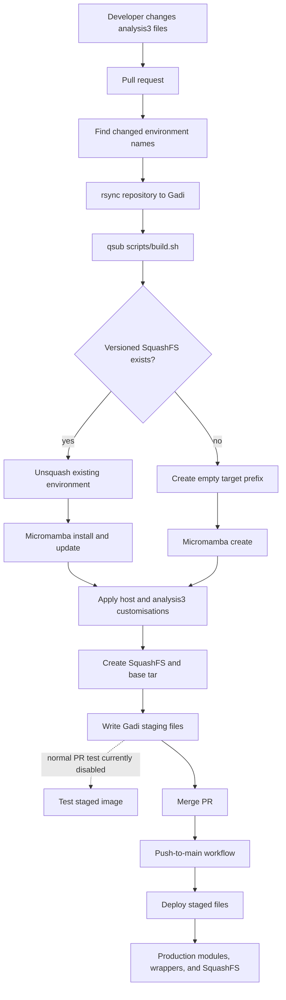
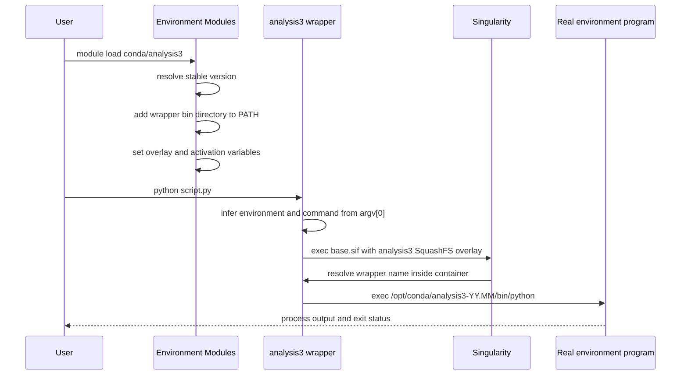

# Analysis3 build, deployment, and runtime design

## Document status

This document describes the current `analysis3` system as implemented in this
repository on 23 July 2026. It is a description of the existing system, not a
proposal for its replacement.

The focus is everything that happens after `pixi.toml` and `pixi.lock` have
been produced: GitHub Actions, Gadi, PBS, Micromamba, Singularity, SquashFS,
Environment Modules, deployment aliases, and command launchers. Ordinary Pixi
dependency authoring is intentionally out of scope.

The following labels distinguish facts from interpretation:

- **Observed:** behavior directly established by the repository.
- **Inferred intent:** the most likely reason for behavior, but not stated as a
  contract by the code.
- **Disabled:** code exists, but the normal PR workflow does not run it.
- **Risk:** behavior that is fragile, surprising, or insufficiently guarded.
- **Needs Gadi validation:** behavior that depends on external filesystem,
  module, scheduler, or Singularity state that cannot be inspected here.

## Executive summary

The system is not primarily a container-image build. It is a system for
installing a large Conda environment once, compressing it into a single
read-only SquashFS file, and making every command appear to run normally by
intercepting it with launcher scripts.

There are three distinct layers:

1. **GitHub Actions is the control plane.** It finds changed environments,
   synchronizes the repository to Gadi, and invokes remote build, test, and
   deploy operations.
2. **A PBS job on Gadi is the build plane.** It reconstructs the production
   filesystem in job-local storage, installs or updates the environment inside
   Singularity, applies NCI-specific changes, creates the SquashFS image, and
   stages the result.
3. **Singularity plus modules and wrappers is the runtime plane.** A module
   adds wrapper commands to `PATH`. A wrapper starts the minimal base
   Singularity image with the selected environment SquashFS mounted as an
   overlay, then runs the real command inside it.

The normal PR and merge lifecycle is unusual:

- A PR builds and stages an environment on Gadi.
- The PR test job is currently disabled.
- A push to `main` does not rebuild. It deploys the staged files left by the PR
  build.

The result is a versioned environment such as `analysis3-26.07.sqsh`, module
aliases such as `conda/analysis3` and `conda/analysis3-unstable`, and a wrapper
directory containing names such as `python`, `jupyter`, and `mpirun`. These
wrapper names all point to one `launcher.sh`.

## System context

### Control and data flow



### Runtime flow



The wrapper is intentionally encountered twice. On the host it launches
Singularity. Inside the container, Singularity itself is unavailable at the
configured path, so the wrapper detects that it is already inside and executes
the real environment program. This is the "short circuit" in
[`launcher.sh`](../scripts/launcher.sh#L123-L134).

## Terminology

| Term | Meaning in this repository |
| --- | --- |
| **Base image** | `base.sif`, a minimal Singularity filesystem skeleton. It does not contain the analysis environment. |
| **Environment SquashFS** | A read-only image such as `analysis3-26.07.sqsh` containing `/opt/conda/analysis3-26.07`. |
| **Overlay** | A SquashFS supplied through repeated Singularity `--overlay` arguments. Later overlays take precedence. |
| **Base installation** | The shared Micromamba executable, base Singularity image, module templates, and wrapper infrastructure under `apps/med_conda`, `modules`, and `apps/med_conda_scripts`. It is not the analysis environment itself. |
| **Wrapper tree** | `apps/med_conda_scripts/<environment>.d/bin`, containing one launcher and many command-name symlinks. |
| **Generated module fragment** | A hidden file such as `modules/conda/.analysis3-26.07` containing environment variables captured from Micromamba activation. |
| **Version module** | A symlink such as `modules/conda/analysis3-26.07 -> .common_v4`. |
| **Module alias** | A name such as `conda/analysis3` that Environment Modules maps to a version module through `.modulerc`. |
| **Staging** | Private files under `/g/data/xp65/admin/med_conda/admin/staging` produced by a build and later consumed by deploy. |
| **Stable/unstable** | Moving aliases controlled by `STABLE_VERSION` and `UNSTABLE_VERSION`; they do not describe separate Pixi environments. |

## Components and ownership

### GitHub workflows

| File | Responsibility |
| --- | --- |
| [`pull_request.yml`](../.github/workflows/pull_request.yml) | Orchestrates changed-environment detection, repository synchronization, optional base-image construction, and PR builds. |
| [`get_changed_env.yml`](../.github/workflows/get_changed_env.yml) | Converts changed paths beneath `environments/` into a job matrix. |
| [`build.yml`](../.github/workflows/build.yml) | Connects to Gadi and submits the blocking PBS build job. |
| [`test.yml`](../.github/workflows/test.yml) | Connects to Gadi and submits the blocking PBS test job. |
| [`push_to_main.yml`](../.github/workflows/push_to_main.yml) | Synchronizes merged source and deploys previously staged artifacts. |
| [`deploy.yml`](../.github/workflows/deploy.yml) | Connects to Gadi and runs `scripts/deploy.sh` directly on the login host. |
| [`manual_trigger.yml`](../.github/workflows/manual_trigger.yml) | Runs setup, build, test, and deploy for an explicitly selected environment. |
| [`pixi-lock-diff.yml`](../.github/workflows/pixi-lock-diff.yml) | Comments a human-readable `pixi.lock` diff on analysis3 PRs. |
| [`pixi-broken-package-check.yml`](../.github/workflows/pixi-broken-package-check.yml) | Reports whether broken-channel packages in the lock agree with explicit declarations. |

### Shared scripts

| File | Responsibility |
| --- | --- |
| [`install_config.sh`](../scripts/install_config.sh) | Defines global paths and loads the selected environment's configuration. |
| [`build.sh`](../scripts/build.sh) | Reconstructs, installs, customizes, packages, and stages an environment. |
| [`initialise.sh`](../scripts/initialise.sh) | Creates the shared Micromamba/base-image/module infrastructure when it does not yet exist. |
| [`test.sh`](../scripts/test.sh) | Reconstructs the staged result, runs pytest inside the staged overlay, and interprets JUnit output. |
| [`deploy.sh`](../scripts/deploy.sh) | Copies staged infrastructure to production and replaces the versioned SquashFS. |
| [`functions.sh`](../scripts/functions.sh) | Implements permissions, module aliases, activation capture, atomic symlinks, copying, and PBS temporary-directory setup. |
| [`launcher.sh`](../scripts/launcher.sh) | Intercepts runtime commands and launches them in Singularity. |
| [`launcher_conf.sh`](../scripts/launcher_conf.sh) | Template for production paths and runtime bind directories. |
| [`condaenv.sh`](../scripts/condaenv.sh) | Prints the variables and aliases created by Micromamba activation so they can be converted into a module fragment. |
| [`dev_prep.sh`](../scripts/dev_prep.sh) | Provides an interactive, job-local copy of the deployed unstable environment for manual development. |

### Analysis3-specific files

| File | Responsibility |
| --- | --- |
| [`config.sh`](../environments/analysis3/config.sh) | Selects the version being built and the stable/unstable versions; declares host replacements and outside commands. |
| [`build_inner.sh`](../environments/analysis3/build_inner.sh) | Performs Jupyter, ESMValTool, telemetry, and MPI modifications after installation. |
| [`deploy.sh`](../environments/analysis3/deploy.sh) | Updates stable/unstable module aliases and filesystem symlinks. |
| [`testconfig.yml`](../environments/analysis3/testconfig.yml) | Configures the exhaustive Python import test's skips, preloads, and allowed errors. |
| [`environment.yml`](../environments/analysis3/environment.yml) | Fully pinned export consumed by Micromamba. It is generated from the Pixi lock. |

### Runtime support

| File | Responsibility |
| --- | --- |
| [`container.def`](../container/container.def) | Defines the minimal host-integrating Singularity base image. |
| [`common_v4`](../modules/common_v4) | Common modulefile loaded for every versioned environment. |
| [`overrides/`](../scripts/overrides) | Special behavior for SSH, PBS remote launch, Jupyter overlay selection, and MPI compiler configuration. |

## Configuration model

Every build, test, and deploy begins with a `CONDA_ENVIRONMENT` name. For this
document the value is `analysis3`.

[`install_config.sh`](../scripts/install_config.sh#L1-L29) establishes the
global defaults:

```text
CONDA_BASE                 /g/data/xp65/public
ADMIN_DIR                  /g/data/xp65/admin/med_conda/admin
SCRIPT_SUBDIR              apps/med_conda_scripts
MODULE_SUBDIR              modules
APPS_SUBDIR                apps
CONDA_INSTALL_BASENAME     med_conda
MODULE_NAME                conda
JOB_LOG_DIR                <ADMIN_DIR>/logs
BUILD_STAGE_DIR            <ADMIN_DIR>/staging
CONTAINER_PATH             <synced-repository>/container/base.sif
SINGULARITY_BINARY_PATH    /opt/singularity/bin/singularity
APPS_USERS_GROUP           xp65
APPS_OWNERS_GROUP          xp65_w
```

If `CONDA_ENVIRONMENT` is set, it then sources
`environments/$CONDA_ENVIRONMENT/config.sh` and creates empty defaults for any
optional arrays that the environment did not define
([lines 31-45](../scripts/install_config.sh#L31-L45)). This is the main
extension boundary between shared machinery and a specific environment.

For analysis3, [`config.sh`](../environments/analysis3/config.sh#L10-L24)
currently sets:

```text
VERSION_TO_MODIFY   26.07
STABLE_VERSION      26.06
UNSTABLE_VERSION    26.07
ENVIRONMENT         analysis3
FULLENV             analysis3-26.07
CONDA_OVERRIDE_CUDA 12
```

It also declares:

```text
rpms_to_remove              openssh-clients openssh-server openssh
replace_from_apps           ucx/1.18.1 openmpi/5.0.8
outside_commands_to_include pbs_tmrsh ssh
```

These arrays do not affect dependency solving. They tell the post-install
build how to alter the installed prefix and which host commands need wrapper
entries.

### The `/./` path component

`CONDA_SCRIPT_PATH` and `CONDA_MODULE_PATH` deliberately contain `/./`:

```text
/g/data/xp65/public/./apps/med_conda_scripts
/g/data/xp65/public/./modules/conda
```

GNU `rsync --relative` treats the path after `/./` as the relative portion to
recreate at the destination. For example, copying
`/g/data/xp65/public/./modules/conda` into a temporary root produces
`<temporary-root>/modules/conda`, rather than reproducing the complete
`g/data/xp65/public` path. This is why comments call the extra component
"arcane rsync magic" in [`install_config.sh`](../scripts/install_config.sh#L13-L17)
and [`build.sh`](../scripts/build.sh#L248-L250).

## Filesystem model

Understanding the multiple views of the filesystem is essential. The same
logical files appear at different host, job-local, and container paths.

### Production layout on Gadi

For the current example versions, the expected relevant layout is:

```text
/g/data/xp65/public/
|-- apps/
|   |-- med_conda/
|   |   |-- bin/
|   |   |   `-- micromamba
|   |   |-- etc/
|   |   |   `-- base.sif
|   |   `-- envs/
|   |       |-- analysis3-26.06.sqsh
|   |       |-- analysis3-26.07.sqsh
|   |       |-- analysis3-26.06 -> /opt/conda/analysis3-26.06
|   |       |-- analysis3-26.07 -> /opt/conda/analysis3-26.07
|   |       |-- analysis3 -> analysis3-26.06
|   |       `-- analysis3-unstable -> analysis3-26.07
|   `-- med_conda_scripts/
|       |-- launcher.sh
|       |-- launcher_conf.sh
|       |-- overrides/
|       |-- analysis3-26.06.d/
|       |   |-- bin/
|       |   `-- overrides/
|       |-- analysis3-26.07.d/
|       |   |-- bin/
|       |   `-- overrides/
|       |-- analysis3.d -> analysis3-26.06.d
|       `-- analysis3-unstable.d -> analysis3-26.07.d
`-- modules/
    `-- conda/
        |-- .common_v4
        |-- .modulerc
        |-- .analysis3-26.06
        |-- .analysis3-26.07
        |-- analysis3-26.06 -> .common_v4
        `-- analysis3-26.07 -> .common_v4
```

**Needs Gadi validation:** this tree is derived from the path construction and
symlink operations. The repository cannot verify the current production
contents or whether old versions have been manually arranged differently.

The symlinks from version names to `/opt/conda/...` are intentionally broken
on the host. The target becomes valid inside Singularity after the
corresponding SquashFS is mounted.

### Private administration and staging layout

```text
/g/data/xp65/admin/med_conda/admin/
|-- logs/
|-- staging/
|   |-- analysis3-26.07.sqsh.tmp
|   |-- conda_base.analysis3.tar
|   |-- deployed.analysis3.yml
|   `-- deployed.analysis3.old.yml
|-- conda_base.analysis3.tar
`-- analysis3-26.07.sqsh.bak
```

The staging directory is the hand-off between PR build and post-merge deploy.
The admin directory also receives the last deployed base tar and a one-deep
backup of the overwritten versioned SquashFS.

### PBS job-local layout

`CONDA_TEMP_PATH` resolves to `$PBS_JOBFS` during builds. The important paths
created beneath it are:

```text
$PBS_JOBFS/
|-- overlay/
|   `-- g/data/xp65/public/
|       |-- apps/med_conda/...
|       |-- apps/med_conda_scripts/...
|       `-- modules/conda/...
`-- squashfs-root/
    `-- opt/conda/analysis3-26.07/
```

The `overlay/g/data/xp65/public` tree is a writable copy of production support
infrastructure. It is bind-mounted at `/g` inside Singularity, so it appears at
the same absolute path as production. `squashfs-root` is the unpacked or newly
created environment that will become the next SquashFS.

The final environment is installed at
`$PBS_JOBFS/squashfs-root/opt/conda/$FULLENV`. This ensures that when
`squashfs-root` becomes an overlay, the prefix appears at
`/opt/conda/$FULLENV`, the same path embedded in its scripts and Conda metadata.

## GitHub workflow behavior

### Changed-environment selection

[`get_changed_env.yml`](../.github/workflows/get_changed_env.yml#L20-L41)
diffs either the PR base or the pre-push commit against the current SHA. For
each changed path containing the substring `environments`, it uses the parent
directory's basename as an environment name and constructs a JSON matrix.

Examples:

```text
environments/analysis3/pixi.lock  -> analysis3
environments/analysis3/config.sh  -> analysis3
scripts/build.sh                  -> no environment
container/container.def          -> no environment
```

The selector does not validate that the inferred directory is exactly one
level below `environments/`. It also performs duplicate detection with a string
match against the JSON under construction.

### Pull request workflow

The PR workflow proceeds as follows
([`pull_request.yml`](../.github/workflows/pull_request.yml)):

1. Generate the changed-environment matrix.
2. If the matrix is nonempty, run a setup job inside a privileged Singularity
   GitHub Actions container.
3. Detect whether `container/container.def` changed.
4. If so, build `container/base.sif` on the GitHub runner.
5. Synchronize the checked-out repository, including a newly built `base.sif`,
   to `GADI_REPO_PATH` using rsync over SSH.
6. Connect to Gadi and ensure the admin, log, and staging directories exist
   with restricted ACLs.
7. For each changed environment, invoke the reusable build workflow. The
   matrix is deliberately serialized with `max-parallel: 1`.

The reusable build workflow connects to Gadi and submits
[`scripts/build.sh`](../scripts/build.sh) through PBS
([`build.yml` lines 20-25](../.github/workflows/build.yml#L20-L25)):

```text
queue       copyq
project     iq82
ncpus       1
memory      40 GB
walltime    10 hours
jobfs       50 GB
storage     gdata/xp65 + scratch/iq82 + gdata/tm70
umask       037
```

`qsub -Wblock=true` makes the SSH command wait for PBS completion, so the
GitHub job result tracks the build script's exit status.

**Disabled:** the PR test job is commented out in
[`pull_request.yml` lines 61-70](../.github/workflows/pull_request.yml#L61-L70).
Consequently a normal PR can succeed after staging a build without executing
`scripts/test.sh`.

### Push-to-main workflow

On a push to `main`, [`push_to_main.yml`](../.github/workflows/push_to_main.yml)
again calculates changed environment names and synchronizes the repository to
Gadi. It then runs the reusable deploy workflow for each selected environment.

The deploy workflow does not submit PBS work. It runs
[`scripts/deploy.sh`](../scripts/deploy.sh) directly during an SSH session on
Gadi. It expects the staging artifacts already to exist.

**Observed:** a merge deploys the result staged during the PR; it does not
rebuild from the merged commit.

### Manual workflow

[`manual_trigger.yml`](../.github/workflows/manual_trigger.yml#L35-L54) accepts
an arbitrary environment name and runs setup, build, test, and deploy in
sequence. Unlike the normal PR path, testing is active here. Unlike the changed
environment workflows, it does not infer the environment name from a diff.

### Pixi-specific PR reporting

The lock-diff workflow is independent of the Gadi build. It installs
`pixi-diff` and `pixi-diff-to-markdown`, compares the PR lock to the base-branch
lock, and updates a labeled PR comment. It runs only when `pixi.lock` changes
([`pixi-lock-diff.yml`](../.github/workflows/pixi-lock-diff.yml#L3-L45)).

The broken-package workflow runs the repository's Python checker and always
attempts to post its report. It is triggered by either `pixi.toml` or
`pixi.lock` changes
([`pixi-broken-package-check.yml`](../.github/workflows/pixi-broken-package-check.yml#L3-L37)).

Neither reporting workflow installs or tests the actual environment.

## Build lifecycle in detail

The build has an outer phase on the Gadi PBS host and an inner phase executed
inside Singularity. Both phases are implemented by the same script:
`scripts/build.sh` reinvokes itself as `scripts/build.sh --inner --install` or
`--inner --update`.

### 1. Configuration and temporary paths

The script requires `CONDA_ENVIRONMENT`, enables `set -eu`, changes to
`SCRIPT_DIR`, and sources global plus environment configuration
([`build.sh` lines 1-30](../scripts/build.sh#L1-L30)). It derives:

```text
OVERLAY_BASE             $PBS_JOBFS/overlay
CONDA_OUTER_BASE         $PBS_JOBFS/overlay/g/data/xp65/public
ENV_INSTALLATION_PATH    $PBS_JOBFS/squashfs-root/opt/conda/$FULLENV
CONDA_INSTALLATION_PATH  /g/data/xp65/public/./apps/med_conda
MAMBA                    <CONDA_INSTALLATION_PATH>/bin/micromamba
MAMBA_ROOT_PREFIX        <CONDA_INSTALLATION_PATH>
ENV_FILE                 <synced-repository>/environments/analysis3/environment.yml
```

`initialise_tmp_dirs .conda .mamba micromamba` redirects selected home
directories into `$PBS_JOBFS` by temporarily replacing them with symlinks
([`functions.sh` lines 241-262](../scripts/functions.sh#L241-L262)). This avoids
putting package-manager caches in the user's home filesystem during the PBS
job. Existing real directories are left in place with a warning.

### 2. Copy or bootstrap the shared base installation

If `/g/data/xp65/public/apps/med_conda` already exists, the build copies three
production trees into `CONDA_OUTER_BASE` using ACL- and hardlink-preserving
rsync:

- `apps/med_conda`, excluding all `*.sqsh` files;
- `apps/med_conda_scripts`;
- `modules/conda`.

This happens at [`build.sh` lines 160-164](../scripts/build.sh#L160-L164).
Excluding SquashFS files prevents every historical environment image from
being copied into the build job.

If the base installation does not exist, the build calls
[`initialise.sh`](../scripts/initialise.sh). Inside Singularity, initialization:

1. Creates the shared installation prefix.
2. Downloads the ACCESS-NRI Micromamba distribution and extracts
   `bin/micromamba` and `bin/activate`.
3. Installs shared launcher and override scripts.
4. Renders the common module and launcher configuration with production paths.

Outside Singularity it copies `base.sif` into `apps/med_conda/etc`, applies
permissions, creates `envs`, and stages a `conda_base.tar`
([`initialise.sh` lines 43-57](../scripts/initialise.sh#L43-L57)). The enclosing
build later creates the environment-specific `conda_base.analysis3.tar` that
deployment consumes.

**Inferred intent:** initialization is a disaster/bootstrap path for a new
installation, not part of routine monthly builds.

### 3. Copy declared external files

The generic build can copy paths listed in `outside_files_to_copy` into the
writable `/g` overlay
([`build.sh` lines 170-175](../scripts/build.sh#L170-L175)). This supports
environment customizations that need a `/g/data/...` file to be present during
the build even when it is not visible through a normal bind.

Analysis3 does not currently set this array, so this phase performs no copies.

### 4. Choose update or fresh installation

The decision is based solely on whether the versioned production image exists:

```text
/g/data/xp65/public/apps/med_conda/envs/$FULLENV.sqsh
```

If it exists, `unsquashfs` extracts it beneath `$PBS_JOBFS/squashfs-root`, the
copied environment symlink is removed, and `DO_UPDATE=--update` is selected.
If it does not exist, the build creates an empty `conda-meta` directory and
selects `DO_UPDATE=--install`
([`build.sh` lines 177-188](../scripts/build.sh#L177-L188)).

It then creates a temporary symlink in the copied base installation:

```text
$CONDA_OUTER_BASE/apps/med_conda/envs/$FULLENV
    -> $PBS_JOBFS/squashfs-root/opt/conda/$FULLENV
```

Because `$CONDA_OUTER_BASE` is bind-mounted to `/g`, Micromamba sees the prefix
through its production-looking `/g/data/xp65/public/...` name while modifying
files in PBS storage.

**Observed:** "new version" and "fresh build" are not synonymous. The first
build of a new `FULLENV` is fresh. Subsequent builds of that same version begin
by unpacking and mutating the deployed image.

### 5. Select the base Singularity image

If the synchronized repository contains `container/base.sif`, the build uses
it. Otherwise it uses the production copy from the reconstructed base tree:

```text
$CONDA_OUTER_BASE/apps/med_conda/etc/base.sif
```

This fallback is selected at
[`build.sh` lines 192-197](../scripts/build.sh#L192-L197). The build constructs
a bind list from directories that exist on the host and appends
`$OVERLAY_BASE:/g`.

It then executes itself inside Singularity
([`build.sh` lines 199-208](../scripts/build.sh#L199-L208)). The container sees:

```text
Host/PBS path                                      Container path
$PBS_JOBFS/overlay                                 /g
$PBS_JOBFS/squashfs-root/opt/conda/$FULLENV        reached through the /g symlink
selected host directories                         same absolute paths
```

### 6. Install or update with Micromamba

In `--install` mode, Micromamba creates the prefix from `environment.yml` with
`--relocate-prefix` set to the same production prefix
([`build.sh` lines 34-41](../scripts/build.sh#L34-L41)).

In `--update` mode, the script:

1. Appends the existing `conda-meta/history` to `history.log`.
2. Clears the current history.
3. Exports the old environment to `deployed.analysis3.old.yml`.
4. Runs `micromamba install -f environment.yml` to add missing packages.
5. Runs `micromamba update -f environment.yml` to update existing packages.
6. Deletes the old wrapper `bin` and `overrides` trees so they can be rebuilt.

The two Micromamba operations are at
[`build.sh` lines 42-55](../scripts/build.sh#L42-L55). After either branch, the
new installed state is exported to `deployed.analysis3.yml`.

If the old and new exports are byte-identical, the inner build returns early
([`build.sh` lines 58-63](../scripts/build.sh#L58-L63)). The outer build checks
the same files later and stages both exports before exiting without creating a
new image.

**Observed:** Pixi has already solved the desired package set, but Micromamba
still interprets the generated Conda environment file. Most entries are pinned
to exact versions and builds, but the install remains a separate package-manager
operation and update mode preserves untracked mutations from the old image.

### 7. Remove RPM-provided files

For each configured RPM and for each of `bin`, `lib`, `etc`, `libexec`, and
`include`, the build asks `rpm -qli` for every path owned by the RPM, reduces
each result to its basename, and deletes matching files or directories from the
current environment subdirectory
([`build.sh` lines 65-77](../scripts/build.sh#L65-L77)).

For analysis3 the RPMs are OpenSSH client/server packages. The likely goal is
to prevent environment-provided SSH programs or libraries from conflicting
with Gadi's host authentication and remote-launch infrastructure.

**Risk:** only the basename is retained. If an RPM owns two different paths
with the same basename, or the environment has an unrelated file with that
basename in one of the scanned directories, it can be deleted. Word splitting
also assumes RPM paths contain no whitespace.

### 8. Replace environment files with NCI `/apps` files

For every entry in `replace_from_apps`, the build walks its `bin`, `etc`, `lib`,
and `include` directories under `/apps`. Each corresponding file in the Conda
environment is removed and replaced by an absolute symlink back into `/apps`
([`build.sh` lines 79-94](../scripts/build.sh#L79-L94)).

Analysis3 replaces files from:

```text
/apps/ucx/1.18.1
/apps/openmpi/5.0.8
```

**Inferred intent:** the Conda packages provide dependency metadata and a
compatible namespace, while execution uses the NCI-supported MPI/UCX build
that is integrated with Gadi's interconnect and scheduler.

The generic `replace_with_external` array performs the same operation for an
arbitrary path rather than `/apps`; analysis3 currently leaves it empty
([`build.sh` lines 96-113](../scripts/build.sh#L96-L113)).

### 9. Rebuild shared runtime infrastructure

The inner build updates the copied production support tree:

1. Copy `launcher.sh` if its contents changed.
2. Copy every override script if changed.
3. Render `modules/common_v4` as `.common_v4` with production paths.
4. Render `launcher_conf.sh` with production paths.
5. Create `$FULLENV.d/bin` and `$FULLENV.d/overrides`.
6. Copy the launcher and launcher configuration into the versioned `bin`.
7. For every entry in the environment's real `bin`, create a same-named symlink
   to `launcher.sh`.
8. Add wrapper names for `pbs_tmrsh` and `ssh`, even though they are not meant
   to come from the environment.
9. Link all shared overrides into the versioned override directory.

See [`build.sh` lines 116-143](../scripts/build.sh#L116-L143).

The resulting wrapper tree resembles:

```text
apps/med_conda_scripts/analysis3-26.07.d/
|-- bin/
|   |-- launcher.sh
|   |-- launcher_conf.sh
|   |-- python -> launcher.sh
|   |-- jupyter -> launcher.sh
|   |-- mpirun -> launcher.sh
|   |-- ssh -> launcher.sh
|   `-- pbs_tmrsh -> launcher.sh
`-- overrides/
    |-- functions.sh -> ../../overrides/functions.sh
    |-- ssh.sh -> ../../overrides/ssh.sh
    |-- pbs_tmrsh.sh -> ../../overrides/pbs_tmrsh.sh
    |-- jupyter.config.sh -> ../../overrides/jupyter.config.sh
    `-- mpicc.config.sh -> ../../overrides/mpicc.config.sh
```

The wrapper tree is outside the SquashFS so launcher behavior can be updated
without rewriting every command inside the read-only environment.

### 10. Run the analysis3 inner-build hook

The generic build sources an environment-specific `build_inner.sh`, if present,
inside the same shell and activated environment
([`build.sh` lines 145-149](../scripts/build.sh#L145-L149)). Analysis3 performs
the following operations.

#### Activate the environment

The hook installs the Micromamba shell integration and activates the prefix.
It temporarily disables unset-variable checking because activation scripts may
reference variables not defined under `set -u`
([`build_inner.sh` lines 3-6](../environments/analysis3/build_inner.sh#L3-L6)).

#### Rewrite the ESMValTool shebang

The first line of the `esmvaltool` executable is rewritten to the production
Micromamba-visible prefix
([line 9](../environments/analysis3/build_inner.sh#L9)). This is an explicit
prefix fix after installation.

#### Build JupyterLab assets

`jupyter lab build` is run unconditionally
([line 11](../environments/analysis3/build_inner.sh#L11)). This compiles the
installed extension/application state into the environment before it becomes
read-only.

#### Link shared ESMValTool configuration

The packaged configuration files are replaced with absolute symlinks under:

```text
/g/data/xp65/public/apps/esmvaltool/config_2.0/
```

The hook links the reference configuration, default user configuration, extra
facets, and three data configuration files
([`build_inner.sh` lines 15-36](../environments/analysis3/build_inner.sh#L15-L36)).
These links make configuration centrally maintainable outside the SquashFS,
but the environment depends on those exact production paths at runtime.

#### Install the import-telemetry hook

A top-level `sitecustomize.py` symlink is added to site-packages, targeting:

```text
/g/data/xp65/admin/analysis3/sitecustomize.py
```

Python imports `sitecustomize` automatically during interpreter startup when
available. The modulefile separately sets the log directory and interval.
See [`build_inner.sh` lines 38-41](../environments/analysis3/build_inner.sh#L38-L41)
and [`common_v4` lines 96-98](../modules/common_v4#L96-L98).

#### Patch the Fortran MPI library

The hook copies NCI's compiler-specific
`libmpi_mpifh_GNU.so.40.40.1` into the environment and creates the expected
unversioned and major-version symlinks
([`build_inner.sh` lines 43-50](../environments/analysis3/build_inner.sh#L43-L50)).
The comment states that NCI exposes multiple compiler variants without a
default and that the otherwise selected library is wrong.

Finally, the generic inner build runs `micromamba clean -a -f -y`, reducing the
package cache copied into later artifacts.

### 11. Copy a newly built base image into the base tree

After the inner build returns, if `container/base.sif` exists in the synced
repository, it is always copied to `apps/med_conda/etc/base.sif`
([`build.sh` lines 210-217](../scripts/build.sh#L210-L217)). The commented hash
comparison shows that change detection was considered but is not active.

The log therefore says "Container update detected" whenever the file exists,
not only when its content changed.

### 12. Handle a no-change update

The outer script repeats the old/new deployment export comparison. If equal,
it copies both exports into staging and exits without generating a new
SquashFS or base tar
([`build.sh` lines 219-223](../scripts/build.sh#L219-L223)).

Deployment also compares these staged files and exits without publishing when
they match. This two-stage check is intended to let the later deploy workflow
recognize that the PR build was a no-op.

### 13. Create the version module on first installation

For a new version, the build creates:

```text
modules/conda/$FULLENV -> .common_v4
```

Updates assume the link already exists. All version modules therefore execute
the same common Tcl modulefile; the loaded module name selects the environment
version.

### 14. Create and stage the SquashFS

The build changes the extracted prefix's group to `xp65`, then runs
`mksquashfs` over the entire `squashfs-root`
([`build.sh` lines 230-239](../scripts/build.sh#L230-L239)). Important options:

- no fragments, duplicates, sparse handling, exports, or recovery file;
- no compression for inode, data, fragment, or extended-attribute tables;
- eight processors;
- stderr redirected to `/dev/null`.

The result is first created in `$PBS_JOBFS`, then copied to:

```text
$BUILD_STAGE_DIR/$FULLENV.sqsh.tmp
```

It receives application-user ownership and ACLs through `set_apps_perms`.

An optional environment-specific `build_outer.sh` would run after packaging;
analysis3 does not currently provide one.

### 15. Replace the temporary environment link with its runtime target

The build removes the temporary symlink into `$PBS_JOBFS` and replaces it with:

```text
apps/med_conda/envs/$FULLENV -> /opt/conda/$FULLENV
```

This is the symlink included in the base tar and eventually deployed. It is
resolved only inside Singularity after the environment overlay supplies
`/opt/conda/$FULLENV`.

### 16. Generate the hidden activation fragment

The function `construct_module_insert` runs a pristine environment inside the
base container with the staged SquashFS overlay. It invokes
[`condaenv.sh`](../scripts/condaenv.sh), which:

1. Starts from `PATH=/usr/bin:/bin`.
2. initializes the shared Micromamba shell hook;
3. activates `/opt/conda/$FULLENV`;
4. prints the resulting environment and aliases.

`construct_module_insert` converts that output into Tcl module commands
([`functions.sh` lines 144-191](../scripts/functions.sh#L144-L191)):

- selected variables are discarded;
- path-like values become `prepend-path` operations;
- system paths are removed from `PATH`;
- the environment `bin` entry is replaced with the external wrapper directory;
- other variables become `setenv` operations;
- shell aliases become module aliases.

The generated output is written as:

```text
modules/conda/.$FULLENV
```

This capture makes normal module loading fast: users do not run Micromamba to
calculate activation on every module load.

### 17. Create and stage the base tar

The reconstructed base tree receives production ACLs. GNU tar then archives:

```text
apps/med_conda
modules
apps/med_conda_scripts
```

into:

```text
$BUILD_STAGE_DIR/conda_base.analysis3.tar
```

The tar uses the non-POSIX GNU `--acls` extension. Finally, the new deployment
export and, for updates, the old export are copied to staging
([`build.sh` lines 248-263](../scripts/build.sh#L248-L263)).

## Staged artifact contract

The following table is the implicit interface between build, test, and deploy.

| Artifact | Producer | Test consumer | Deploy consumer |
| --- | --- | --- | --- |
| `$FULLENV.sqsh.tmp` | `build.sh` | Mounted as the environment overlay | Moved to production as `$FULLENV.sqsh` |
| `conda_base.analysis3.tar` | `build.sh` | Extracted into a job-local `/g` tree | Extracted, then rsynced to production; archived under `ADMIN_DIR` |
| `deployed.analysis3.yml` | Micromamba export in `build.sh` | Used only for no-change detection | Compared to the old export, then deleted |
| `deployed.analysis3.old.yml` | Update-mode Micromamba export | Used only for no-change detection | Compared to the new export, then deleted |

For a new version there is no old export. The build's conditional copy tolerates
that, but both test and deploy call `diff` on both names without explicitly
checking for absence. GNU `diff` returns nonzero for a missing old file, which
causes the scripts to proceed as a changed environment.

**Risk:** no manifest associates these artifacts with a Git commit, PR number,
lock hash, workflow run, or base-image hash.

## Test lifecycle

### Invocation and resources

The reusable test workflow submits `scripts/test.sh` through PBS with
([`test.yml`](../.github/workflows/test.yml#L20-L24)):

```text
ncpus       4
memory      20 GB
walltime    20 minutes
jobfs       50 GB
storage     gdata/xp65 + scratch/iq82
project     iq82
umask       037
```

It uses `-Wblock=true`, so GitHub waits for the PBS result.

### Reconstruct the candidate runtime

The outer test first compares the old and new deployment exports and skips all
tests if they match. Otherwise it:

1. Extracts `conda_base.analysis3.tar` into the job-local reconstructed
   production tree.
2. Copies any declared outside files into the overlay.
3. Chooses the newly synchronized base image if present, otherwise the one from
   the extracted base tar.
4. Builds the usual host bind string and adds the writable `/g` overlay.
5. Runs itself inside Singularity with `$FULLENV.sqsh.tmp` as an additional
   overlay.

See [`test.sh` lines 51-85](../scripts/test.sh#L51-L85).

### Inner test execution

Inside the candidate runtime, the script:

1. Sources an optional environment-specific `test_inner.sh`; analysis3 has
   none.
2. Activates the installed prefix with Micromamba.
3. If `py.test` is available, removes any old XML result and starts
   `py.test -s --junitxml test_results.xml` in the background.
4. Polls every five seconds until the result file exists.
5. If the pytest process is still alive once the file appears, kills it with
   `SIGKILL`, then waits without using its exit status.
6. If pytest is absent, writes a synthetic successful JUnit document.

This behavior is in [`test.sh` lines 19-49](../scripts/test.sh#L19-L49). The
comment says pytest hangs during interpreter shutdown inside Singularity, so
the XML file rather than the process exit code is treated as authoritative.

Because the outer script changes to `SCRIPT_DIR`, pytest discovers the test
files in `scripts/`, including
[`test_environment.py`](../scripts/test_environment.py) and
[`test_python.py`](../scripts/test_python.py).

The main test recursively imports installed Python packages. Analysis3's
[`testconfig.yml`](../environments/analysis3/testconfig.yml) defines modules to
skip, modules to preload, and import failures to tolerate. A separate test runs
`cdo --version`, and another checks that Python is newer than 3.0.

### Outer result interpretation

After Singularity exits, the outer script requires `test_results.xml`. It may
source an environment-specific `test_outer.sh`; analysis3 has none. It then
uses the host `python3` XML library to read the first test suite's `errors` and
`failures` attributes and fails if either is nonzero
([`test.sh` lines 87-101](../scripts/test.sh#L87-L101)).

**Risk:** the parser calls `Element.getchildren()`, which was removed from
modern Python versions. Whether the host `python3` on Gadi still supports it
requires validation.

**Risk:** the inner loop waits indefinitely if pytest never creates the XML
file. The PBS walltime is the only outer bound.

**Risk:** killing pytest as soon as the XML file appears assumes the XML is
complete and flushed before process shutdown.

## Deployment lifecycle

Deployment is implemented by shared
[`scripts/deploy.sh`](../scripts/deploy.sh) followed by analysis3's own
[`deploy.sh`](../environments/analysis3/deploy.sh).

### 1. Prepare a temporary extraction directory

The shared deploy script requires `CONDA_ENVIRONMENT`, sources configuration,
creates a temporary directory under `BUILD_STAGE_DIR`, and arranges to delete
it on exit
([`deploy.sh` lines 1-16](../scripts/deploy.sh#L1-L16)).

Unlike build and test, deployment is run directly through SSH rather than in a
PBS job. Its temporary files therefore remain on the admin filesystem.

### 2. Detect a no-change build

If `deployed.analysis3.yml` and `deployed.analysis3.old.yml` are identical,
deployment deletes both exports and exits. It deliberately leaves no new base
tar or SquashFS because a no-change build did not create them
([`deploy.sh` lines 18-23](../scripts/deploy.sh#L18-L23)).

### 3. Extract the staged base tar

The script extracts `conda_base.analysis3.tar` with ACLs into the temporary
directory. This recreates the three relative trees generated during the build:

```text
apps/med_conda
modules
apps/med_conda_scripts
```

### 4. Synchronize support infrastructure

The first rsync copies the base installation, modules, and scripts into
`/g/data/xp65/public`, preserving hardlinks and ACLs. It intentionally does not
use `--delete` globally. The second rsync targets only `$FULLENV.d` with
`--delete`, ensuring removed wrapper names or override links disappear from
that version's production wrapper tree
([`deploy.sh` lines 31-39](../scripts/deploy.sh#L31-L39)).

The script temporarily disables `set -e` around both rsync commands. As a
result, rsync failures do not immediately abort; execution continues to image
replacement.

**Risk:** this can publish the SquashFS even when support infrastructure was
only partially synchronized.

### 5. Replace the environment image

If the target version already has a SquashFS, it is copied to the admin area as
`$FULLENV.sqsh.bak`. The staged `.sqsh.tmp` is then moved into the production
environment directory as `$FULLENV.sqsh`
([`deploy.sh` lines 41-42](../scripts/deploy.sh#L41-L42)).

The move is atomic only if staging and production are on the same filesystem.
Both paths are currently under `/g/data/xp65`, but possibly different projects
or mounts; this requires Gadi validation. The backup is one-deep and is
overwritten on subsequent deployments of the same version.

### 6. Archive and clean staging files

The environment-specific base tar replaces the admin copy. The deployment
exports and temporary image name are removed
([`deploy.sh` lines 44-47](../scripts/deploy.sh#L44-L47)).

The base tar is retained in the admin directory, but the deploy script contains
no automated rollback command that consumes it together with the `.sqsh.bak`.

### 7. Update stable and unstable aliases

Finally, the shared script sources analysis3's deployment hook. It queries the
current module aliases and computes:

```text
NEXT_STABLE   analysis3-$STABLE_VERSION
NEXT_UNSTABLE analysis3-$UNSTABLE_VERSION
```

The configured aliases are:

```text
stable:   analysis3 esmvaltool ilamb
unstable: analysis3-unstable
```

If no unstable alias exists and stable differs from unstable, the hook treats
this as the start of a new unstable cycle: it writes `.modulerc`, points stable
names at `NEXT_STABLE`, and points unstable names at `NEXT_UNSTABLE`
([`analysis3/deploy.sh` lines 11-18](../environments/analysis3/deploy.sh#L11-L18)).

Otherwise it does not rewrite `.modulerc`; it only updates filesystem symlinks
when the queried module aliases disagree with the desired versions
([lines 19-31](../environments/analysis3/deploy.sh#L19-L31)).

`write_modulerc` removes lines for the affected aliases and appends new
`module-version` directives
([`functions.sh` lines 80-129](../scripts/functions.sh#L80-L129)).
`symlink_atomic_update` creates a temporary link in the destination directory
and renames it over the public name
([`functions.sh` lines 132-142](../scripts/functions.sh#L132-L142)).

### Monthly promotion example

With the current configuration:

```text
VERSION_TO_MODIFY = 26.07
STABLE_VERSION    = 26.06
UNSTABLE_VERSION  = 26.07
```

the intended public view is:

```text
conda/analysis3          -> conda/analysis3-26.06
conda/esmvaltool         -> conda/analysis3-26.06
conda/ilamb              -> conda/analysis3-26.06
conda/analysis3-unstable -> conda/analysis3-26.07

apps/med_conda/envs/analysis3          -> analysis3-26.06
apps/med_conda/envs/analysis3-unstable -> analysis3-26.07
apps/med_conda_scripts/analysis3.d          -> analysis3-26.06.d
apps/med_conda_scripts/analysis3-unstable.d -> analysis3-26.07.d
```

When a future configuration changes stable to `26.07` and unstable to a new
version, the same mechanism promotes the former unstable environment without
renaming or rebuilding its versioned SquashFS.

## Base Singularity image

[`container.def`](../container/container.def) uses `Bootstrap: scratch`.
Nothing like Ubuntu, Rocky Linux, or a Conda environment is installed in it.

The definition creates:

- standard root-level symlinks such as `/bin -> /usr/bin`;
- symlinks into `/half-root` for parts of Gadi's system installation;
- mount points for `/etc`, `/usr`, `/run`, `/system`, service sockets, cgroups,
  and other NCI filesystems;
- `/opt/conda`, where the environment overlay will appear;
- a runscript that starts `/usr/bin/bash -l`.

See [`container.def` lines 3-45](../container/container.def#L3-L45).

At build and runtime, the scripts bind existing host directories into those
mount points. The image is therefore a filesystem namespace and overlay host,
not an independent operating-system distribution.

**Inferred intent:** this design preserves compatibility with Gadi's host
libraries, authentication, scheduler sockets, device stack, and administrative
software while using Singularity to mount the environment SquashFS at a stable
prefix.

**Consequence:** the deployed environment is not portable away from Gadi. It
contains absolute links to `/apps` and `/g/data`, and the base image expects
Gadi-specific bind mounts.

## Module loading in detail

### Version resolution

Environment Modules first resolves a public alias through `.modulerc`. For
example, `conda/analysis3` may resolve to `conda/analysis3-26.06`. The version
module itself is a symlink to `.common_v4`, so the common modulefile obtains the
version by examining `[module-info name]`
([`common_v4` lines 43-53](../modules/common_v4#L43-L53)).

The module warns when an analysis3 version is more than six months old, and
prints a notice for a version more than one month in the future
([`common_v4` lines 3-41](../modules/common_v4#L3-L41)).

### Paths selected by the module

For `conda/analysis3-26.07`, the rendered common module computes approximately:

```text
basedir      /g/data/xp65/public/apps/med_conda/envs/analysis3-26.07
myscripts    /g/data/xp65/public/apps/med_conda_scripts/analysis3-26.07.d/bin
overlay_path /g/data/xp65/public/apps/med_conda/envs/analysis3-26.07.sqsh
launcher     <myscripts>/launcher.sh
```

It loads the Singularity module, prepends the SquashFS to
`CONTAINER_OVERLAY_PATH`, and sources the hidden generated activation fragment
`modules/conda/.analysis3-26.07`
([`common_v4` lines 55-75](../modules/common_v4#L55-L75)).

The generated fragment makes the wrapper directory appear where activated
Conda would normally place the environment's real `bin` directory. This is why
typing `python` runs a host-visible launcher symlink rather than attempting to
execute a file that exists only inside the SquashFS.

### Additional runtime variables

The common module also configures:

- OpenMPI's remote launch agent;
- `MAMBA_ROOT_PREFIX` and `CONDA_EXE` for Micromamba-compatible activation;
- the Dask Jobqueue PBS Python wrapper;
- Benchcab and Payu launcher paths;
- Cartopy data;
- climate-ref configuration and cache paths;
- an NCI utility path;
- Python import telemetry output;
- Mellanox HColl libraries when present.

These settings are at
[`common_v4` lines 77-103](../modules/common_v4#L77-L103). Several contain
hard-coded `/g/data/xp65/public` paths rather than rendered template values.

When unloading, the module refuses to proceed if `CONDA_SHLVL > 1`, instructing
the user to deactivate nested environments first.

## Runtime launcher in detail

### Determine whether the file was sourced

`launcher.sh` treats `$0` values such as `bash`, `sh`, and `zsh` as evidence
that the file was sourced rather than executed
([`launcher.sh` lines 18-35](../scripts/launcher.sh#L18-L35)). This path exists
for editor integrations such as VS Code.

### Determine the requested command

The versioned `bin` directory contains many symlinks to the same launcher. If
invoked through `python -> launcher.sh`, `$0` remains the requested wrapper path
and the launcher constructs a command beginning with that path. If
`launcher.sh` is invoked directly, its remaining arguments are treated as the
command to run
([`launcher.sh` lines 91-100](../scripts/launcher.sh#L91-L100)).

The following internal options can carry state across remote launcher calls:

```text
--cms_singularity_overlay_path_override
--cms_singularity_overlay_path <path-list>
--cms_singularity_in_container_path <PATH>
--cms_singularity_launcher_override <launcher>
--cms_singularity_singularity_path <binary>
```

They are parsed and removed before the real program is invoked
([`launcher.sh` lines 42-80](../scripts/launcher.sh#L42-L80)). They are not
intended as a user interface.

### Infer environment and overlay

The launcher derives the environment name from the parent directory ending in
`.d`. It ensures that environment's SquashFS is present in
`CONTAINER_OVERLAY_PATH`, unless an explicit override says not to. It also sets
`CONDA_BASE` to the host-side logical environment symlink
([`launcher.sh` lines 104-121](../scripts/launcher.sh#L104-L121)).

Overlay order matters: the code comment states that the last Singularity
`--overlay` argument has precedence. The default environment overlay is
prepended so explicitly supplied later overlays can override it.

### In-container short circuit

On the host, the configured Singularity binary is expected to exist. If it is
missing, the launcher first attempts `module load singularity` and discovers
the executable dynamically
([`launcher.sh` lines 84-89](../scripts/launcher.sh#L84-L89)).

If Singularity remains unavailable and the launcher was not sourced, the code
assumes it is already running inside the container. It rewrites the command to
`$CONDA_BASE/bin/<program>` and uses `exec -a` to preserve the original
`argv[0]` value. Preserving `argv[0]` matters to some virtual-environment and
entrypoint behaviors.

### Command-specific overrides

Before launching Singularity, the launcher checks the versioned `overrides`
directory. A `<command>.sh` file replaces the command completely; a
`<command>.config.sh` file modifies launcher configuration before normal
execution
([`launcher.sh` lines 136-146](../scripts/launcher.sh#L136-L146)).

#### SSH

[`ssh.sh`](../scripts/overrides/ssh.sh) uses `findreal` to locate the next `ssh`
on `PATH`, excluding its own wrapper, and executes it directly on the host.
This prevents SSH from being started inside Singularity and avoids the removed
environment OpenSSH implementation.

#### PBS remote launch

[`pbs_tmrsh.sh`](../scripts/overrides/pbs_tmrsh.sh) parses the host and leading
PBS options, finds the real host `pbs_tmrsh`, and inserts `launcher.sh` before
the remote command. It passes the current Singularity binary, launcher path,
overlay list, and `PATH` through the private options above.

This reinjection is what allows a command launched on another PBS node to
reconstruct the same container and environment rather than losing the module
state at the node boundary.

#### MPI compiler

[`mpicc.config.sh`](../scripts/overrides/mpicc.config.sh) exports
`WRAPPER_MPI_DIST_OVERRIDE=ompi3` so the NCI MPI wrapper chooses its expected
ABI-specific implementation.

#### Jupyter

[`jupyter.config.sh`](../scripts/overrides/jupyter.config.sh) adds every
production `*.sqsh` environment to the overlay list, unless already present.
The likely purpose is to allow Jupyter and `nb_conda_kernels` to see other
deployed environments from the same container session.

**Risk:** the wildcard includes all versioned images in the shared environment
directory, not just selected aliases, and overlay precedence can expose files
from more than one environment.

### Construct the Singularity invocation

The launcher passes `LD_LIBRARY_PATH`, PROJ data, GDAL data, and relevant
non-system `PATH` entries into Singularity
([`launcher.sh` lines 148-168](../scripts/launcher.sh#L148-L168)). It creates one
`--overlay` argument per entry and builds a comma-separated bind list from
directories that exist on the host.

Normal execution ends with:

```text
singularity -s exec \
  --bind <Gadi host paths> \
  --overlay=<environment image> [--overlay=<additional image> ...] \
  /g/data/xp65/public/apps/med_conda/etc/base.sif \
  <requested command and arguments>
```

See [`launcher.sh` lines 165-196](../scripts/launcher.sh#L165-L196).

### Sourced/editor behavior

When sourced, the launcher does not start Singularity or replace the current
shell. It sets `PROJ_DATA` and `GDAL_DATA` to their in-container locations and
returns
([`launcher.sh` lines 180-193](../scripts/launcher.sh#L180-L193)).

**Observed:** sourced activation alone does not make the environment's real
files available on the host. It prepares variables for an editor integration
that subsequently invokes wrapped programs.

### Debugging

Setting `CMS_CONDA_DEBUG_SCRIPTS` enables stderr diagnostics for derived paths,
command arguments, overlays, binds, short-circuit decisions, and the final
Singularity invocation
([`launcher.sh` lines 11-16](../scripts/launcher.sh#L11-L16)). This is the main
built-in facility for diagnosing runtime wrapper behavior.

## Permissions and access control

Two permission models are implemented in
[`functions.sh`](../scripts/functions.sh#L26-L78):

### Public application files

`set_apps_perms`:

- assigns group `xp65`;
- gives the owning user equivalent group read/execute permissions but removes
  group write;
- removes all other-user permissions;
- gives the owner group `xp65_w` write access through ACLs;
- sets the setgid bit on directories.

These permissions are used for production modules, scripts, base files, and
environment images.

### Private administration files

`set_admin_perms`:

- assigns group `xp65` but explicitly denies it access;
- removes all other-user permissions;
- grants `xp65_w` read/write/traverse access through ACLs;
- applies default ACLs and setgid to directories.

These permissions protect staging files and logs from ordinary application
users while allowing the owner group to maintain them.

The GitHub setup jobs create and normalize the admin, log, and staging
directories before builds. PBS jobs use `umask 037` as an additional default.

## Interactive development path

[`dev_prep.sh`](../scripts/dev_prep.sh) is separate from CI. It must be sourced
inside a PBS job, refuses paths beneath `/g/`, and requires at least 100 GiB of
jobfs per node
([`dev_prep.sh` lines 83-143](../scripts/dev_prep.sh#L83-L143)).

Its initialization path:

1. Copies the base installation, scripts, and modules into jobfs.
2. Copies declared outside files.
3. Unsquashes the currently configured `$FULLENV`.
4. Replaces the copied environment link with a link to the extracted prefix.

It then exposes shell functions:

- `launch`: enter the reconstructed environment in Singularity with an
  interactive Bash shell;
- `finalise`: apply shared removal/replacement/wrapper changes, create a new
  SquashFS in jobfs, and archive the reconstructed base tree.

Unlike `build.sh`, it does not solve or update dependencies itself. It is a way
to modify an already deployed image interactively and manually collect the
result. The script does not publish its outputs.

## Extension points

The shared system supports environment-specific hooks:

| Hook | Execution context | Analysis3 status |
| --- | --- | --- |
| `config.sh` | Sourced by all shared entrypoints | Active |
| `build_inner.sh` | Inside Singularity after install/update, before packaging | Active |
| `build_outer.sh` | On PBS host after SquashFS creation | Absent |
| `test_inner.sh` | Inside candidate environment before pytest | Absent |
| `test_outer.sh` | On PBS host after the inner test | Absent |
| `deploy.sh` | On deployment host after production image replacement | Active |

Hooks are sourced, not executed as child processes. They inherit all variables,
shell options, functions, current directories, and failure behavior from the
shared script.

## Operational properties

### Properties the design provides

**Low inode use for deployed environments.** Thousands of environment files
are stored in one SquashFS file per version.

**Read-only versioned environments.** Normal users mount immutable images and
cannot mutate package contents.

**Stable embedded prefix.** Environments are built under
`/opt/conda/$FULLENV`, the path at which they run.

**Fast module activation.** Micromamba activation is captured once at build
time rather than recalculated for each user.

**Version promotion without rebuilding.** Stable and unstable names can move
between existing versioned images through module directives and symlinks.

**Gadi integration.** Host MPI, UCX, SSH, PBS, identity, and selected system
paths remain available despite the environment filesystem being isolated.

**Job-local builds.** Expensive unpacking and package installation occur under
PBS jobfs rather than directly mutating production.

### Failure behavior

| Failure point | Expected persistence |
| --- | --- |
| GitHub setup before sync completes | Production unchanged; remote repository may be partially synchronized depending on rsync action behavior. |
| PBS build before staging | Production unchanged; PBS jobfs is discarded; existing staging files from another run may remain. |
| PBS build after some staging copies | Production unchanged; staging may contain a mixed or incomplete artifact set. |
| Test failure | Production unchanged in the manual workflow; staged build remains. Normal PRs do not run this test. |
| Deploy during rsync | Script may continue because `set -e` is disabled around rsync. Production support files may be partial. |
| Deploy after SquashFS backup but before replacement | Backup exists; production image may still be old or absent depending on the failed operation. |
| Deploy after image replacement but before alias update | Versioned image is published, but stable/unstable aliases may still point to prior versions. |

No transaction spans the base tar rsync, image replacement, `.modulerc`
rewrite, and stable/unstable symlink updates.

## Current-state assessment

This section identifies observed complexity and risks. It does not prescribe a
replacement design.

### Essential behavior versus implementation inheritance

| Capability | Essential to current service behavior? | Current implementation |
| --- | --- | --- |
| Reproducible dependency selection | Yes | Pixi manifest and lock, exported to Conda YAML |
| Gadi-local build | Currently yes | GitHub SSH plus blocking PBS job |
| Fixed runtime prefix | Yes for existing package metadata and scripts | Job-local install at `/opt/conda/$FULLENV` through symlinks |
| Low-inode immutable distribution | Yes unless service requirements change | SquashFS mounted by Singularity |
| Host MPI/UCX integration | Yes for supported HPC workloads | File replacement and absolute `/apps` symlinks |
| Host SSH/PBS remote execution | Yes for multi-node and authenticated workflows | Wrapper overrides and private state-transfer arguments |
| Module-based user interface | Yes for current users | Common Tcl module plus generated activation fragment |
| Stable/unstable promotion | Yes for current release process | `.modulerc` plus filesystem symlinks |
| Micromamba base installation | Not inherently | Historical installer and activation mechanism |
| Incremental mutation of old images | Not inherently | Unsquash, install, update, and resquash |
| Base tar hand-off through shared staging | Not inherently | PR build to merge-deploy coupling |
| One wrapper symlink per command | Required by the current transparent-launch interface, but not the only possible implementation | Generated versioned wrapper tree |

### Confirmed disabled or unused paths

- The normal PR test job is commented out.
- Analysis3 has no `build_outer.sh`, `test_inner.sh`, or `test_outer.sh`.
- Analysis3 does not use `outside_files_to_copy` or
  `replace_with_external`.
- Base-image hash comparison exists only as commented code; presence is treated
  as an update.

### Risks and likely defects

#### Staging is not tied to source identity

The main deployment consumes filenames shared by all runs. No staged manifest
records the producing Git commit, environment lock hash, base-image hash, PR,
or workflow run. A stale or overwritten staging set can therefore be deployed
after an unrelated merge.

#### Concurrency is controlled only within a single matrix

`max-parallel: 1` serializes environments inside one workflow run. It does not
prevent a manual workflow, another PR, or a push workflow from using the same
Gadi repository or staging directory concurrently. There is no filesystem or
scheduler lock keyed by environment/version.

#### Container-only changes do not select a build

The PR setup job, including container change detection, runs only when the
changed-environment matrix is nonempty. A PR that changes only
`container/container.def` produces an empty matrix, skips setup, and therefore
does not build or validate `base.sif`. A container definition change is acted
on only when an environment file also changes.

#### Shared script changes do not select environments

Changes beneath `scripts/`, `modules/`, or most workflows do not add any
environment to the matrix. Their behavior is exercised only if the same diff
also changes an environment directory or a manual workflow is run.

#### PR testing is disabled

The merge gate described by the root README no longer matches the workflow.
Only the manual workflow currently sequences build, test, and deploy.

#### Build CPU request and SquashFS CPU use disagree

The build requests one PBS CPU, while `mksquashfs` explicitly starts eight
processors. This can oversubscribe the allocated resources and violate
scheduler policy.

#### SquashFS diagnostics are suppressed

`mksquashfs` sends stderr to `/dev/null`. With `set -e`, failure stops the build,
but the useful diagnostic may be absent from logs.

#### Deployment ignores rsync failures temporarily

Both production rsync operations execute while `set -e` is disabled. Their
statuses are not checked before the environment image is published.

#### Builds are not clean reconstructions of the lock

When a versioned SquashFS exists, the build mutates it rather than creating a
fresh prefix. Files introduced by prior post-install operations or manual
changes can survive if they are not explicitly removed.

#### Change detection does not include all behavior

The deployed old/new YAML comparison describes Micromamba's package view, not
the base image, launcher scripts, module template, build hook outputs, or
external linked content. A support-script-only or post-install-only change can
be classified as "no package changes" and exit before producing a new image.

#### Versioned image replacement is not a full deployment transaction

The support tree, SquashFS, `.modulerc`, and stable/unstable symlinks change in
separate operations. Readers can observe a mixed state during deployment, and
rollback is manual.

#### Generated activation can become stale

The hidden module fragment captures activation output at build time. Changes
to external activation scripts, Micromamba behavior, or host configuration do
not take effect until the environment is rebuilt and the fragment regenerated.

#### Hard-coded production paths limit reuse

Although parts of the module and launcher are templated, `common_v4` and
analysis3 hooks contain literal `/g/data/xp65` and `/apps` paths. Test installs
using overridden `CONDA_BASE` can still refer to production services.

#### Several shell loops are unsafe for unusual filenames

The build uses command substitution and word splitting around `rpm`, `find`,
and `ls`. Conda and `/apps` filenames normally avoid whitespace, but the code
does not robustly preserve arbitrary pathnames.

#### Test result parsing is legacy code

The outer test uses removed `ElementTree.getchildren()` behavior, the inner
test can wait forever for XML, and pytest is forcibly killed rather than
allowed to report its own exit status.

#### Module query drives deployment decisions

The analysis3 deploy hook determines whether symlinks should change by parsing
`module aliases` output. This couples deployment logic to the host module
command's formatting and current module path behavior.

#### Module aliases are rewritten only when the unstable alias is absent

`write_modulerc` is called only when `CURRENT_UNSTABLE` is empty and the next
stable and unstable versions differ. If an unstable alias already exists, the
hook can move the `analysis3` and `analysis3-unstable` filesystem symlinks but
does not rewrite `.modulerc`. A normal version change can therefore leave the
Environment Modules aliases pointing at their previous version unless some
external step first removes the unstable alias. Whether the operational
monthly process deliberately creates that condition needs Gadi validation.

#### Micromamba variables remain part of the public module contract

`MAMBA_ROOT_PREFIX`, `CONDA_EXE`, `CONDA_SHLVL`, and the activation capture are
used by the public module even though package selection is now authored in
Pixi. Removing Micromamba is therefore not limited to changing the installer;
runtime activation and module generation also depend on it.

### Questions requiring Gadi validation

1. Are `base.sif`, version symlinks, and wrapper trees in production exactly as
   derived above?
2. Which `/apps` and other host filesystems are automatically made visible by
   Singularity in addition to explicit binds?
3. Is moving from admin staging to public applications atomic on the actual
   mounted filesystems?
4. Which host Python executes the JUnit parser, and does it still implement
   `Element.getchildren()`?
5. Does the `copyq` policy permit `mksquashfs -processors 8` in a one-CPU job?
6. Do multiple GitHub workflows share one `GADI_REPO_PATH` and staging
   directory, and have concurrent runs occurred operationally?
7. Are the admin base tar and `.sqsh.bak` used by a documented manual rollback
   procedure outside this repository?
8. Does `jupyter.config.sh` intentionally mount every historical environment
   image, and is overlay ordering relied on by `nb_conda_kernels`?
9. Is import telemetry's `/g/data/xp65/admin/analysis3/sitecustomize.py`
   readable from all supported runtime contexts?
10. Which deployment identities own files, and do ACL operations behave the
    same on all relevant Gadi filesystems?

## End-to-end trace for one user-visible change

The following example ties the components together.

1. A developer changes `environments/analysis3/pixi.toml`, updates `pixi.lock`,
   regenerates `environment.yml`, and opens a PR.
2. GitHub's matrix generator sees an `environments/analysis3/...` path and
   selects `analysis3`.
3. The repository is synchronized to the configured Gadi checkout.
4. GitHub connects to Gadi and submits `scripts/build.sh` with
   `CONDA_ENVIRONMENT=analysis3`.
5. PBS gives the job private jobfs. Configuration expands `FULLENV` to
   `analysis3-26.07`.
6. The job copies the shared Micromamba, module, and wrapper infrastructure to
   jobfs. If `analysis3-26.07.sqsh` exists, it is unsquashed.
7. The job bind-mounts its reconstructed `/g` tree into `base.sif` and invokes
   the inner build.
8. Micromamba installs and updates the fully pinned generated Conda file.
9. OpenSSH files are removed, UCX/OpenMPI files become links to NCI `/apps`,
   wrapper trees are regenerated, and the analysis3 hook modifies Jupyter,
   ESMValTool, telemetry, and MPI state.
10. The job creates `analysis3-26.07.sqsh.tmp`, captures activation as
    `.analysis3-26.07`, archives the support tree, and writes all files to the
    private staging directory.
11. The normal PR workflow stops here because its test job is disabled.
12. After merge, the push workflow synchronizes the merged repository and runs
    deploy for `analysis3`.
13. Deploy extracts the staged support tree, rsyncs it to production, backs up
    any old `analysis3-26.07.sqsh`, and moves the candidate image into place.
14. The analysis3 deploy hook ensures stable and unstable module aliases and
    wrapper/environment symlinks match `config.sh`.
15. A user loads `conda/analysis3-unstable`. The common module resolves
    `analysis3-26.07`, adds its wrapper tree to `PATH`, and selects its
    SquashFS.
16. The user's `python` command enters the wrapper, which starts `base.sif` with
    the environment overlay and Gadi host binds. The same wrapper short-circuits
    inside the container to `/opt/conda/analysis3-26.07/bin/python`.

That complete path, rather than dependency solving alone, is what this
repository currently calls building and deploying analysis3.
